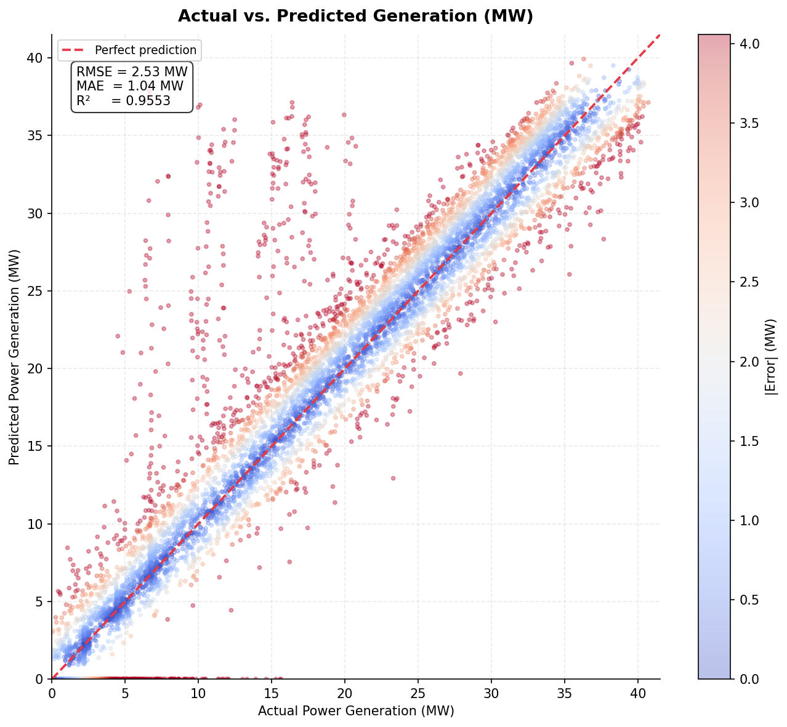
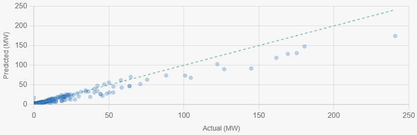
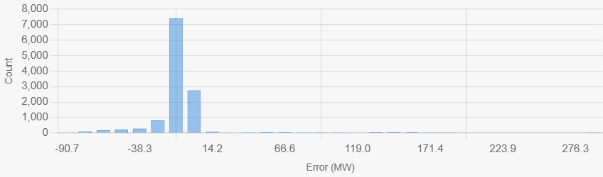

# 🌿 EcoPower: Physics-Guided Renewable Forecasting


**EcoPower** is a high-fidelity forecasting engine and dashboard designed to bridge the gap between meteorological physics and machine learning. Built specifically for the Karnataka Power Grid, it provides 15-minute granularity generation forecasts for Solar and Wind assets using a hybrid **Physics-Guided Machine Learning (PGML)** approach.

---

## 🚀 Live Demo
**Hosted on Render:** [eco-power-dashboard.onrender.com](https://eco-power-dashboard.onrender.com)  
*(Note: Initial load may take ~30s on free tier due to cold start)*

---

## 🧠 The Secret Sauce: Physics-Guided AI
Unlike "black-box" models, EcoPower utilizes a **Hybrid Pipeline**:

1.  **Solar Physics Layer**: Uses the `pvlib` library to model Sun Zenith Angle (SZA), Air Mass, and Plane-of-Array (POA) irradiance based on the specific tilt and azimuth of each plant.
2.  **Atmospheric Modeling**: Fetches real-time Shortwave Radiation, Cloud Cover, and DNI/DHI from Open-Meteo.
3.  **LightGBM Inference**: A gradient-boosted decision tree trained on years of historical SCADA data processes the physics-informed features to predict actual generation with high precision.
4.  **Hybrid Scaling**: Automatically scales predictions from base models to specific plant DC/AC capacities (e.g., scaling a 50MW base model to a 2GW park like Pavagada).

---

## 📊 Model Performance & Insights
*Below are the insights from our trained LightGBM model.*

---

### Model Performance Deep Dive
Detailed scatterplots and regression analysis for our LightGBM models.

#### ☀️ Solar Performance (R^2 = 95.5%)
| Actual vs Predicted (Solar) | Residual Distribution |
| :---: | :---: |
|  |  |

#### 💨 Wind Performance (R^2 = 90.91%)
| Actual vs Predicted (Wind) | Error Analysis |
| :---: | :---: |
|  |  |

---
### Attributes Used to Train Lightgbm ###
### Solar - 40+ such as DHI,DNI,GHI,Cloud Cover,Temperature,etc...
### Wind - 5+ such as Wind Speed,Wind Direction,Temperature,Pressure,etc...


### Feature Importance (SHAP)
The model prioritizes **GHI (Global Horizontal Irradiance)** and **SZA (Sun Zenith Angle)**, but also weighs **Cloud Cover** and **Rolling Efficiency** to handle weather volatility.
---

## 🕒 The Clock-Sync Simulation Engine
To ensure a high-fidelity user experience even in the absence of live grid telemetry APIs, we engineered a custom **Clock-Sync Feeder** (`feeder.py`).

- **Real-Time Handshake**: The engine synchronizes with the system clock and matches the current wall-clock time to historical high-resolution SCADA records.
- **Dynamic Data Injection**: Every 60 seconds, it aggregates and injects state-wide generation metrics into our SQLite diagnostics layer.
- **Live UI Response**: This allows the frontend to demonstrate real-time graph movements, asset status updates, and "Actual vs Predicted" analytics as if it were connected to a live SLDC stream.
- **Future-Ready Architecture**: The data pipeline is designed as a "plug-and-play" interface. Once official API keys are provisioned, the feeder can be swapped for live MQTT or HTTP streams with zero changes to the visualization layer.

---

## 🛠️ Tech Stack
-   **Frontend**: React 18, Vite, Tailwind CSS, Recharts (Modern, High-Contrast UI).
-   **Backend**: FastAPI (Python), Uvicorn, Gunicorn.
-   **AI/Physics**: LightGBM, Scikit-Learn, PVLib, Pandas, NumPy.
-   **Data Source**: Open-Meteo API (Live Weather) & SQLite (Historical Telemetry).
-   **Deployment**: Render (Integrated Build Pipeline).

---

## 📂 Project Structure
```text
ECO_POWER/
├── frontend/             # React Application (Vite)
│   ├── src/components/   # High-fidelity dashboard components
│   └── vite.config.ts    # Dev proxy configuration
├── backend/              # FastAPI Server
│   ├── main.py           # Unified entry point & static file server
│   ├── src/api/          # Prediction & Telemetry routers
│   ├── src/jobs/         # Background scheduler for weather sync
│   └── requirements.txt  # Production dependencies
├── scaled lightgbm example/ # Model weights & training examples
├── build.sh              # Unified deployment script for Render
└── render.yaml           # Infrastructure-as-Code for hosting
```

---

## 💻 Local Development

### 1. Backend
```bash
cd backend
python -m venv venv
source venv/bin/activate  # or venv\Scripts\activate on Windows
pip install -r requirements.txt
python main.py
```

### 2. Frontend
```bash
cd frontend
npm install
npm run dev
```
*The frontend will automatically proxy API requests to `localhost:8000`.*

---


## 📜 License
MIT License. Created for the advancement of renewable energy analytics.
